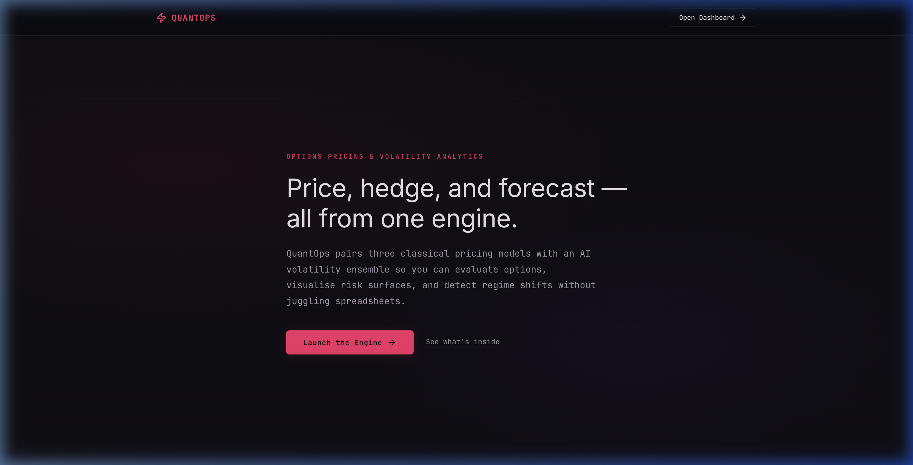
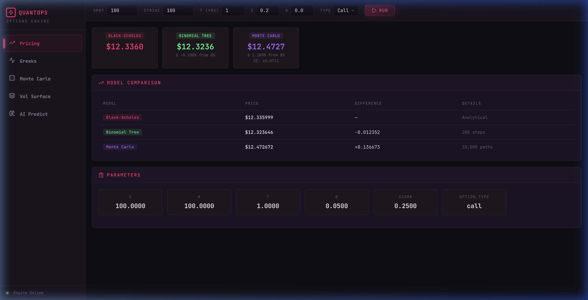
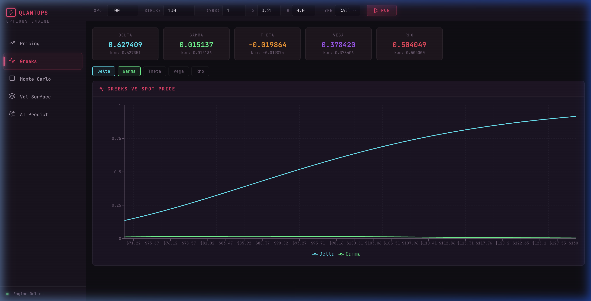
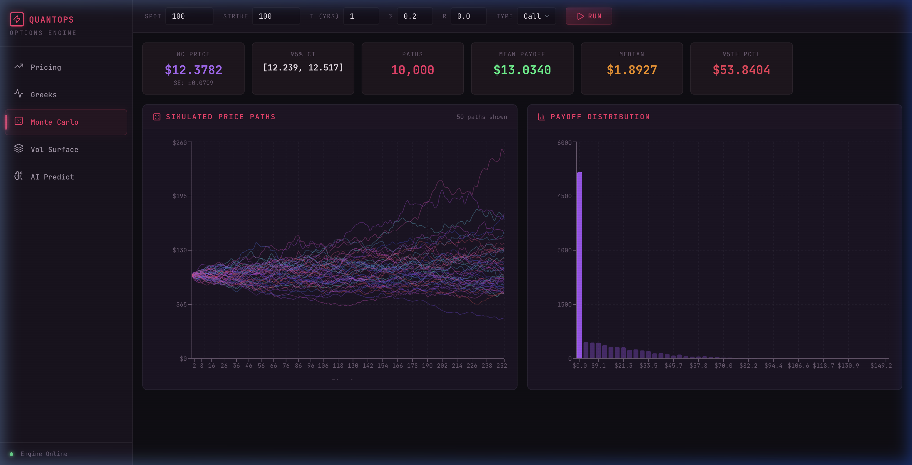
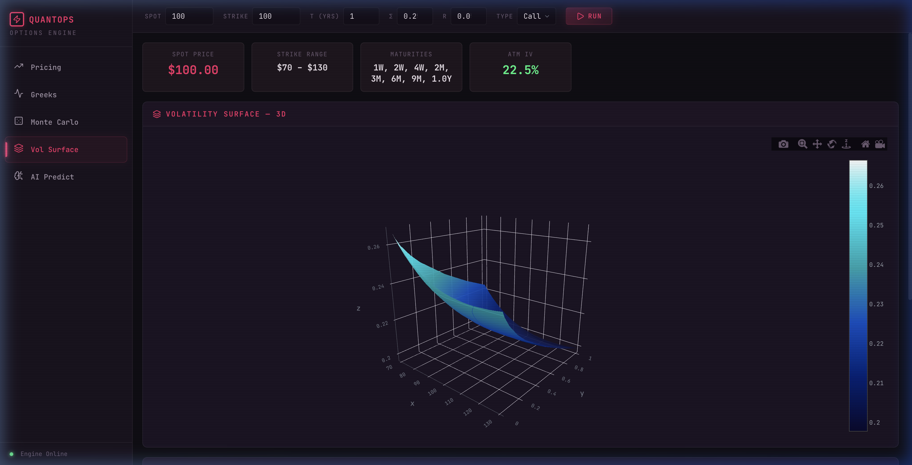
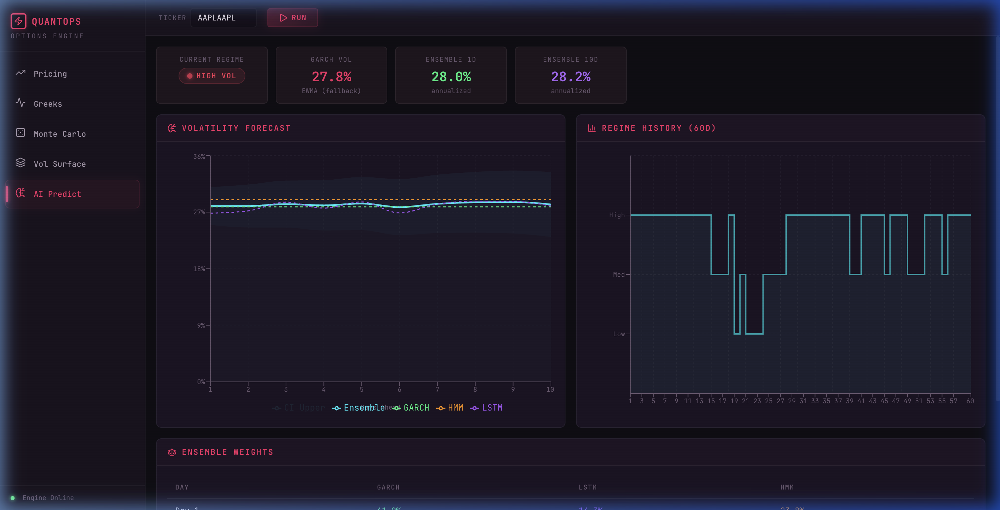

<p align="center">
  <h1 align="center">QuantOps — Options Pricing Engine</h1>
  <p align="center">
    <strong>A quantitative options pricing platform with AI-driven volatility prediction</strong>
  </p>
</p>
---
**QuantOps** is a full-stack options pricing engine that combines classical quantitative finance models with modern AI/ML techniques for volatility forecasting. It features a dark-themed React dashboard with interactive visualizations for pricing comparisons, Greeks analysis, Monte Carlo simulations, volatility surfaces, and ensemble AI predictions.

Link : https://quantops-options-engine.vercel.app

### Landing Page
> A sleek, dark-themed entry point with key metrics and feature highlights at a glance.



### Pricing Comparison
> Compare prices across Black-Scholes, Binomial Tree, and Monte Carlo models in real time with difference analysis.



### Greeks Analysis
> Compute all five Greeks (Δ, Γ, Θ, ν, ρ) with analytical and numerical methods, plus interactive sensitivity charts.



### Monte Carlo Simulation
> Simulate 10,000+ GBM price paths with variance reduction — includes spaghetti plots and payoff distribution histograms.



### Volatility Surface
> It includes a 3D implied volatility surface across 20 strikes and 8 maturities with parametric smile/skew modeling via Plotly.js.



### AI Volatility Prediction
> Ensemble forecast combining GARCH(1,1), LSTM, and HMM with adaptive weights, confidence bands, and regime detection.



---

## Features

| Category | Feature | Details |
|----------|---------|---------|
| **Pricing** | Black-Scholes | Closed-form analytical pricing for European options |
| | Binomial Tree | CRR lattice model with American option support |
| | Monte Carlo | GBM simulation with antithetic & control variate variance reduction |
| **Greeks** | Full Suite | Delta, Gamma, Theta, Vega, Rho — analytical and numerical methods |
| | Sensitivity Charts | Interactive Greeks-vs-spot visualizations |
| **Volatility** | Implied Vol Solver | Newton-Raphson (primary) + Bisection (fallback) |
| | Volatility Surface | Synthetic smile/skew term structure generation |
| **AI/ML** | GARCH(1,1) | Short-term conditional volatility modeling |
| | LSTM Neural Network | Sequence-based deep learning volatility forecaster |
| | Hidden Markov Model | Regime detection (Low / Medium / High volatility) |
| | Ensemble Model | Adaptive weighted combination with confidence intervals |
| **Testing** | 32 Unit Tests | Full coverage of pricing models, Greeks, and API endpoints |

---

## Architecture

### System Architecture Diagram

```
┌─────────────────────────────────────────────────────────────────────────────┐
│                              CLIENT BROWSER                                │
│                                                                             │
│   ┌──────────────────────────────────────────────────────────────────────┐   │
│   │                    React 19 + Vite Frontend                         │   │
│   │                                                                      │   │
│   │  ┌────────────┐ ┌──────────┐ ┌─────────────┐ ┌──────────────────┐   │   │
│   │  │  Pricing   │ │  Greeks  │ │ Monte Carlo │ │  Vol Surface     │   │   │
│   │  │  Panel     │ │  Panel   │ │   Panel     │ │    Panel         │   │   │
│   │  └────────────┘ └──────────┘ └─────────────┘ └──────────────────┘   │   │
│   │  ┌──────────────────────────────────────────────────────────────┐    │   │
│   │  │              AI Prediction Panel                             │    │   │
│   │  └──────────────────────────────────────────────────────────────┘    │   │
│   │                                                                      │   │
│   │  Charts: Recharts (2D) + Plotly.js (3D)    API: Axios               │   │
│   └──────────────────────────────────────────────────────────────────────┘   │
│                             │  HTTP / REST (via Vite Proxy)                  │
└─────────────────────────────┼───────────────────────────────────────────────┘
                              │
                              ▼
┌─────────────────────────────────────────────────────────────────────────────┐
│                         FastAPI Backend (Python)                            │
│                                                                             │
│  ┌─────────────────────────────────────────────────────────────────────┐    │
│  │                        API Layer (api/)                             │    │
│  │  POST /api/price  ·  POST /api/greeks  ·  POST /api/surface       │    │
│  │  POST /api/monte-carlo  ·  POST /api/predict-vol                  │    │
│  │  POST /api/implied-vol  ·  GET /api/health                        │    │
│  └───────────────┬──────────────────────────┬──────────────────────────┘    │
│                  │                          │                               │
│    ┌─────────────▼──────────────┐  ┌────────▼────────────────────┐         │
│    │    Pricing Models (models/) │  │   ML Models (ml/)           │         │
│    │                             │  │                             │         │
│    │  ┌──────────────────────┐   │  │  ┌──────────────────────┐  │         │
│    │  │   Black-Scholes      │   │  │  │   GARCH(1,1)         │  │         │
│    │  │   (Analytical)       │   │  │  │   (arch library)     │  │         │
│    │  └──────────────────────┘   │  │  └──────────────────────┘  │         │
│    │  ┌──────────────────────┐   │  │  ┌──────────────────────┐  │         │
│    │  │   Binomial Tree      │   │  │  │   LSTM Network       │  │         │
│    │  │   (CRR Lattice)      │   │  │  │   (PyTorch)          │  │         │
│    │  └──────────────────────┘   │  │  └──────────────────────┘  │         │
│    │  ┌──────────────────────┐   │  │  ┌──────────────────────┐  │         │
│    │  │   Monte Carlo        │   │  │  │   HMM Regimes        │  │         │
│    │  │   (GBM + VR)         │   │  │  │   (hmmlearn)         │  │         │
│    │  └──────────────────────┘   │  │  └──────────────────────┘  │         │
│    │  ┌──────────────────────┐   │  │  ┌──────────────────────┐  │         │
│    │  │   Implied Vol        │   │  │  │   Ensemble Engine    │  │         │
│    │  │   (Newton / Bisect)  │   │  │  │   (Adaptive Weights) │  │         │
│    │  └──────────────────────┘   │  │  └──────────────────────┘  │         │
│    │  ┌──────────────────────┐   │  │                             │         │
│    │  │   Greeks Engine      │   │  └─────────────────────────────┘         │
│    │  │   (Analytical + Num) │   │                                          │
│    │  └──────────────────────┘   │                                          │
│    └─────────────────────────────┘                                          │
│                                                                             │
│  ┌─────────────────────────────────────────────────────────────────────┐    │
│  │                      Shared Utilities                               │    │
│  │  config.py (settings)  ·  SafeJSONResponse (NaN handling)          │    │
│  └─────────────────────────────────────────────────────────────────────┘    │
└─────────────────────────────────────────────────────────────────────────────┘
```

### Request Flow

```
User Input (S, K, T, σ, r)
       │
       ▼
React Frontend ──( POST /api/price )──▶ FastAPI Router
       │                                      │
       │                              ┌───────┴──────────────┐
       │                              ▼           ▼          ▼
       │                         Black-Scholes  Binomial   Monte Carlo
       │                              │           │          │
       │                              └───────┬──────────────┘
       │                                      │
       │                              JSON Response
       ◀──────────────────────────────────────┘
       │
  Render Results
  (Price Cards, Comparison Table, Charts)
```

---

## Tech Stack

### Backend

| Technology | Version | Purpose |
|-----------|---------|---------|
| **Python** | 3.12+ | Core runtime |
| **FastAPI** | 0.109 | Async REST API framework |
| **Uvicorn** | 0.27 | ASGI server with hot-reload |
| **NumPy** | 1.26 | Numerical computation engine |
| **SciPy** | 1.12 | Statistical functions (`norm.cdf`, `norm.pdf`) |
| **Pandas** | 2.2 | Data manipulation |
| **PyTorch** | 2.2 | LSTM deep learning model |
| **arch** | 6.3 | GARCH(1,1) volatility model |
| **hmmlearn** | 0.3 | Hidden Markov Model regime detection |
| **scikit-learn** | 1.4 | Data preprocessing (StandardScaler) |
| **Pydantic** | 2.6 | Request/response validation |
| **pytest** | 8.0 | Testing framework |
| **httpx** | 0.27 | Async HTTP test client |

### Frontend

| Technology | Version | Purpose |
|-----------|---------|---------|
| **React** | 19.2 | Component-based UI framework |
| **Vite** | 7.3 | Build tool & dev server with HMR |
| **Axios** | 1.13 | HTTP client for API requests |
| **Recharts** | 3.8 | 2D charts (Greeks, Monte Carlo paths) |
| **Plotly.js** | 3.4 | 3D visualizations (volatility surface) |
| **react-plotly.js** | 2.6 | React wrapper for Plotly |

---

## Project Structure

```
Option Trading/
├── README.md
├── docs/
│   └── screenshots/               
│
├── backend/
│   ├── main.py                     # FastAPI app entry point + CORS + SafeJSONResponse
│   ├── config.py                   # Environment settings & defaults
│   ├── requirements.txt            # Python dependencies
│   │
│   ├── api/
│   │   ├── __init__.py
│   │   └── routes.py               # 7 REST endpoints + mock data generator
│   │
│   ├── models/                     # Quantitative pricing models
│   │   ├── __init__.py
│   │   ├── black_scholes.py        # Analytical BS pricing + Greeks
│   │   ├── binomial_tree.py        # CRR lattice (European + American)
│   │   ├── monte_carlo.py          # GBM simulation + variance reduction
│   │   ├── greeks.py               # Analytical & numerical Greeks engine
│   │   └── implied_vol.py          # Newton-Raphson / Bisection IV solver + surface
│   │
│   ├── ml/                         # Machine learning models
│   │   ├── __init__.py
│   │   ├── garch.py                # GARCH(1,1) volatility forecasting
│   │   ├── lstm_model.py           # LSTM neural network for vol prediction
│   │   ├── hmm_model.py            # Hidden Markov Model regime detector
│   │   └── ensemble.py             # Adaptive weighted ensemble combiner
│   │
│   ├── data/
│   │   └── __init__.py             
│   │
│   └── tests/
│       ├── __init__.py
│       ├── test_pricing.py         # 22 unit tests for all pricing models
│       └── test_api.py             # 10 API integration tests
│
└── frontend/
    ├── index.html                  
    ├── package.json                # Node.js dependencies
    ├── vite.config.js              # Vite config with API proxy
    │
    └── src/
        ├── main.jsx                # React app bootstrap
        ├── App.jsx                 # Main app + routing + state management
        ├── index.css               
        │
        ├── api/
        │   └── client.js           # Axios API client (7 endpoints)
        │
        ├── components/
        │   ├── PricingPanel.jsx    # BS / Binomial / MC price comparison
        │   ├── GreeksPanel.jsx     # Greeks cards + sensitivity charts
        │   ├── MonteCarloPanel.jsx # Path simulation + payoff distribution
        │   ├── VolSurfacePanel.jsx # 3D volatility surface (Plotly)
        │   ├── AIPredictionPanel.jsx # Ensemble forecast + regime display
        │   └── Layout.jsx          # Sidebar + top bar layout
        │
        └── theme/
            └── tokens.js           
```

---

## API Reference

| Method | Endpoint | Description |
|--------|----------|-------------|
| `POST` | `/api/price` | Price an option using Black-Scholes, Binomial Tree, Monte Carlo, or all |
| `POST` | `/api/greeks` | Compute all five Greeks (analytical and/or numerical) |
| `POST` | `/api/surface` | Generate volatility surface across strikes × maturities |
| `POST` | `/api/monte-carlo` | Run Monte Carlo simulation with paths + payoff distribution |
| `POST` | `/api/predict-vol` | AI ensemble volatility forecast (GARCH + LSTM + HMM) |
| `POST` | `/api/implied-vol` | Solve for implied volatility from market price |
| `GET` | `/api/health` | Health check |

### Example: Price an Option

```bash
curl -X POST http://localhost:8000/api/price \
  -H "Content-Type: application/json" \
  -d '{
    "S": 100,
    "K": 100,
    "T": 1.0,
    "r": 0.05,
    "sigma": 0.2,
    "option_type": "call",
    "model": "all"
  }'
```

**Response:**
```json
{
  "black_scholes": { "price": 10.4506, "model": "Black-Scholes" },
  "binomial":      { "price": 10.4486, "model": "Binomial Tree (CRR)", "steps": 200 },
  "monte_carlo":   { "price": 10.4312, "model": "Monte Carlo", "n_paths": 10000 },
  "parameters":    { "S": 100, "K": 100, "T": 1.0, "r": 0.05, "sigma": 0.2, "option_type": "call" }
}
```

---

## Getting Started

### Prerequisites

- **Python** 3.12 or higher
- **Node.js** 18 or higher
- **npm** 9 or higher

### Installation

**1. Clone the repository**
```bash
git clone <repo-url>
cd "Option Trading"
```

**2. Backend setup**
```bash
cd backend
pip install -r requirements.txt
```

**3. Frontend setup**
```bash
cd frontend
npm install
```

### Running the Application

**Start the backend** (terminal 1):
```bash
cd backend
python main.py
```
> Backend runs at `http://localhost:8000`

**Start the frontend** (terminal 2):
```bash
cd frontend
npm run dev
```
> Frontend runs at `http://localhost:5173`

Open **http://localhost:5173** in your browser.

### Running Tests

```bash
cd backend
python -m pytest tests/ -v
```

Expected output: **32 tests passed**.

---

## Mathematical Models

### Black-Scholes Formula

The closed-form solution for European call options:

```
C = S·N(d₁) − K·e^(−rT)·N(d₂)

where:
  d₁ = [ln(S/K) + (r + σ²/2)·T] / (σ·√T)
  d₂ = d₁ − σ·√T
```

### Binomial Tree (CRR)

The Cox-Ross-Rubinstein model with parameters:

```
u = e^(σ·√Δt)     (up factor)
d = 1/u             (down factor)
p = (e^(r·Δt) − d) / (u − d)   (risk-neutral probability)
```

Backward induction through 200 time steps with optional early exercise for American options.

### Monte Carlo (GBM)

Geometric Brownian Motion with variance reduction:

```
S(t+Δt) = S(t) · exp[(r − σ²/2)·Δt + σ·√Δt·Z]

Variance Reduction:
  • Antithetic variates: Z and −Z paths
  • Control variates: using S_T as control with Black-Scholes baseline
```

### AI/ML Ensemble

```
σ̂_ensemble(t) = w_garch(t)·σ̂_garch + w_lstm(t)·σ̂_lstm + w_hmm(t)·σ̂_hmm

Adaptive weights:
  • Short-term → GARCH dominates (w ≈ 0.55)
  • Medium-term → LSTM dominates (w ≈ 0.40)
  • High-vol regime → HMM weight increases (w ≈ 0.25)
```

---

